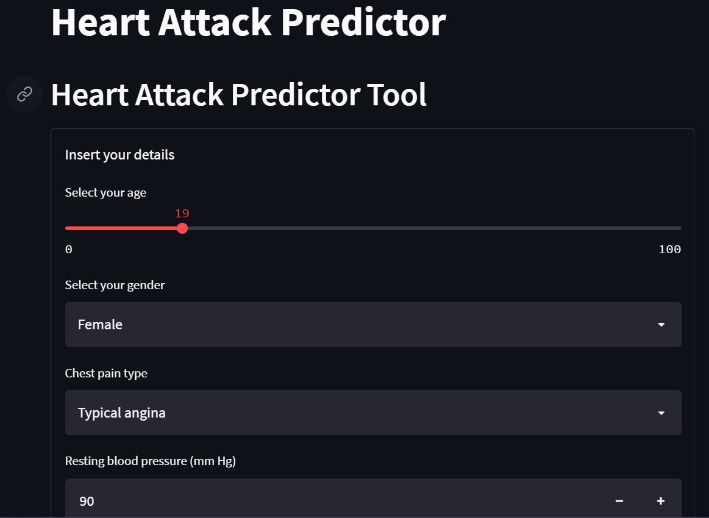
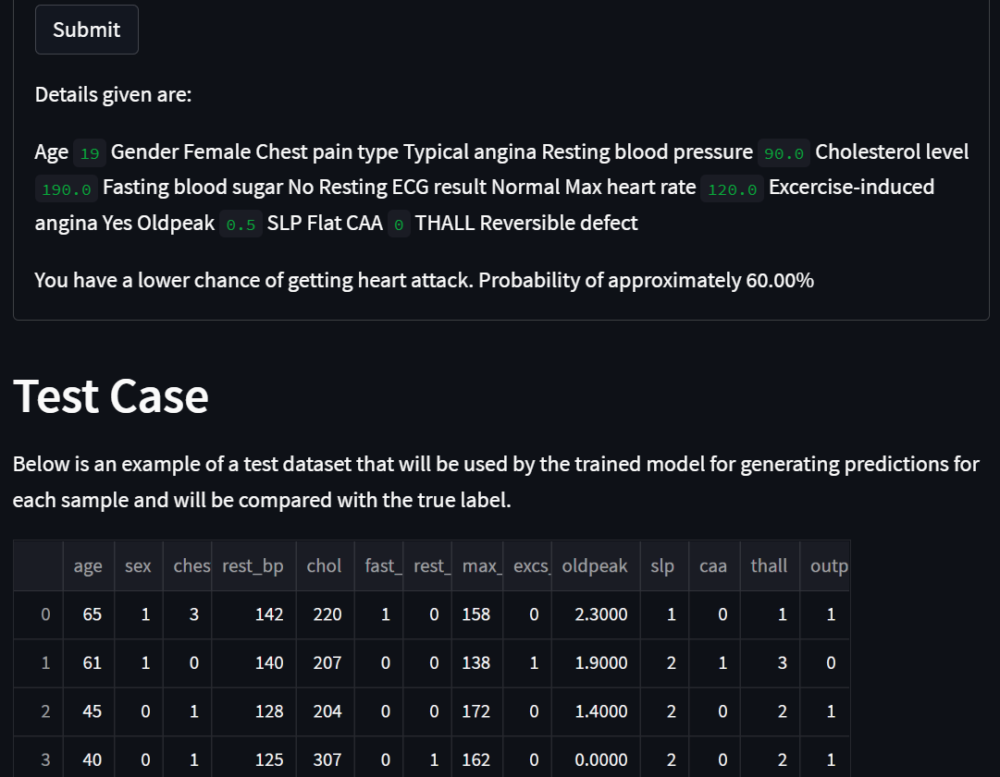

# Project: Heart Attack Predictor

# Description
The project is about developing a web app for predicting whether an individual have a higher or lower chance of getting a heart attack. The web app are developed using Python's Streamlit library. For the predictive model, it is obtained by training a supervised machine learning classification model (Random Forest Classifier) on the [Heart Attack Analysis & Prediction Dataset](https://www.kaggle.com/datasets/rashikrahmanpritom/heart-attack-analysis-prediction-dataset?select=o2Saturation.csv). This dataset contains 300+ sample patients/individuals with their personal/medical details as the features.

# How to Install and Run the Project
To run the web app on a localhost web browser, download/clone the whole repository first. Then, proceed to the directory containin the cloned repository. In the terminal while also in this particular directory, execute `streamlit run app.py`. In a few seconds, the web app will automatically launch as a tab in your default browser.

# How to Use the Web App Predictor
The usage is quite simple. Just input your relevant details as prompted in the form in the web app. Then, submit the filled details and the app will show the prediction.

# Results
## Developed app

# Credits
- [Heart Attack Analysis & Prediction Dataset](https://www.kaggle.com/datasets/rashikrahmanpritom/heart-attack-analysis-prediction-dataset?select=o2Saturation.csv)
- [Markdown badges source 1](https://github.com/Ileriayo/markdown-badges)
- [Markdown badges source 2](https://github.com/alexandresanlim/Badges4-README.md-Profile)
- [Heart Disease Dataset](https://archive.ics.uci.edu/ml/datasets/Heart+Disease)
